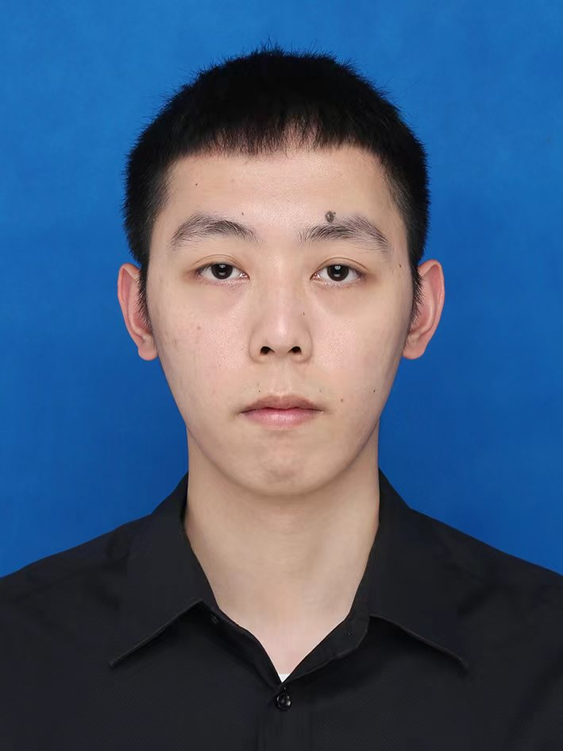
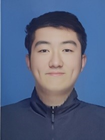
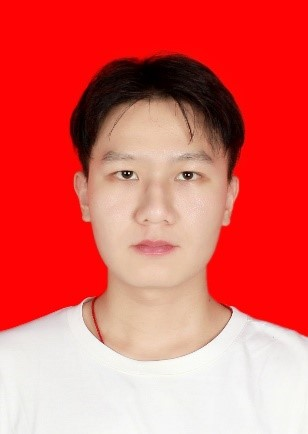

# Members

-----

## Principal Investigator:
### Dr. **Heng Wang**
**wanghengscut@scut.edu.cn**  

{: width="250px" style="float:right; padding-right:10px"} 
Professional appointments:  
2021-present, **Associate Professor**  
Shien-Ming Wu School of Intelligent Engineering, South China University of Technology.   

Education:  
2016-2021, DoctorateDepartment of Mechanical Engineering, University of Minnesota, Twin Cities  
2019-2021, Master's degreeDepartment of Electrical and Computer Engineering, University of Minnesota, Twin Cities  
2012-2016, Bachelor's degreeSchool of Energy and Power Engineering, Xi'an Jiaotong University

Dr. Dong has long been working on the design, manufacture and control of microrobots for important applications such as biomedicine. His research works have been published in several top journals and conferences in the field of robotics, such as IEEE Transactions on Robotics, International Journal of Robotics Research, The IEEE International Conference on Robotics and Automation (ICRA), Robotics: Science and Systems (RSS). His interdisciplinary bioinspired robotics works have also been published in the top multidisciplinary journals such as Science Advances, PNAS and Nature Communications. 

-----

## Ph.D Students
{: width="150px" style="float:left; padding-right:10px"} 
### **Suqi Liu**  

**Email:**  
wisqliu@mail.scut.edu.cn  

**Research Interests:**  
Magnetic Sensing; State Estimation

{: width="150px" style="float:left; padding-right:10px"} 
### **Jiatao Zheng**  
**Email:**  
jtzheng_scut@163.com  

**Research Interests:**  
Magnetic Navigati​on Simulation; Medical Robotics  

---

## Master Students
{: width="150px" style="float:left; padding-right:10px"} 
### **Shuda Dong**  
**Email:**  
wishudadong@mail.scut.edu.cn  

**Research Interests:**  
Magnetic Tracking; Pose Estimation; State Estimation; Active Sensing  

{: width="150px" style="float:left; padding-right:10px"} 
### **Tao Wen**  
**Email:**  
​witaowen@mail.scut.edu.cn

**Research Interests:**  
Magnetic Sensing; Soft Magnet Localization; Medical Robot Positioning

{: width="150px" style="float:left; padding-right:10px"} 
### **Junhao Cui**  
**Email:**  
jh_cui@163.com  

**Research Interests:**  
Soft Magnetic Actuation and Control

{: width="150px" style="float:left; padding-right:10px"} 
### **Haichao Huang**  
**Email:**  
wihuang_haichao@mail.scut.edu.cn

**Research Interests:**  
Magnetic Field Signal Analysis; Position and Posture Tracking   

{: width="150px" style="float:left; padding-right:10px"} 
### **Haoyu Song**  
**Email:**  
202320159929@mail.scut.edu.cn

**Research Interests:**  
Magnetic Navigation Simulation of Medical Robots

{: width="150px" style="float:left; padding-right:10px"} 
### **Yuxiang Han**  
**Email:**  
​202320160073@mail.scut.edu.cn

**Research Interests:**  
Magnetic Actuation

---

## Undergraduate Students

---

## Alumni
* Andrew Haworth (2022.02 - present), Major: ME, VISE Summer Fellow
* Shreya Shrestha (2022.02 - present), Major: BME
* Yilan Xu (2022.02 - present), Major: ME
* Cameron Thomas (2022.03 - present), Major: ME
* Saksham Sharma (2022.04 - present), Major: ME, Clark Scholar

[back](./)

